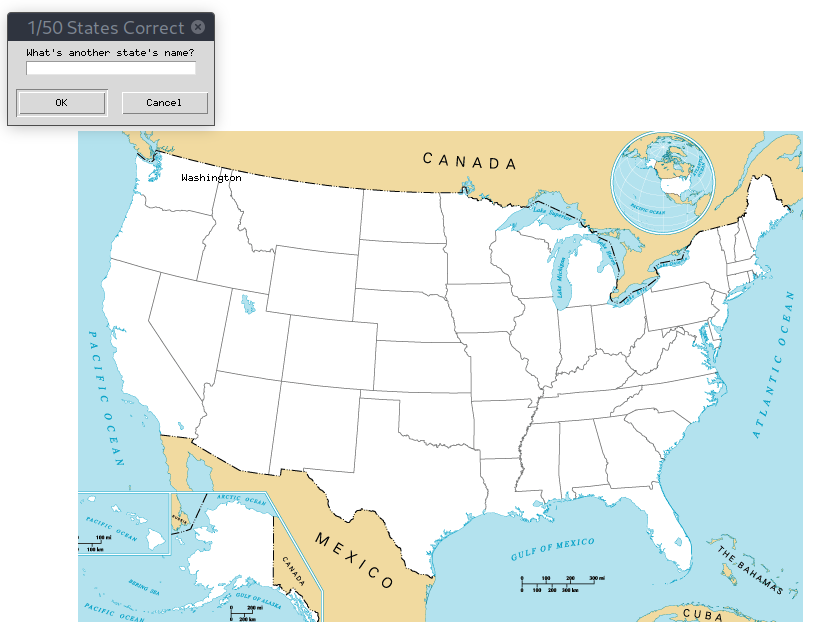

# usgame

## Funny Game in Python. 

### Guess all 50 states of U.S.A. on the map.

**Requirements**:\
`pip install -r requirements.txt`

**Run**: \
`python main.py`

**Board**: \

**Game**:\
Try a State in the TextBox and Win!!!

**Score**:\
Guessed/50 States

**Exit & Learn**:\
Type `exit` in the TextBox for quit and generate file "state_to_learn.csv" conteneid missed states 
